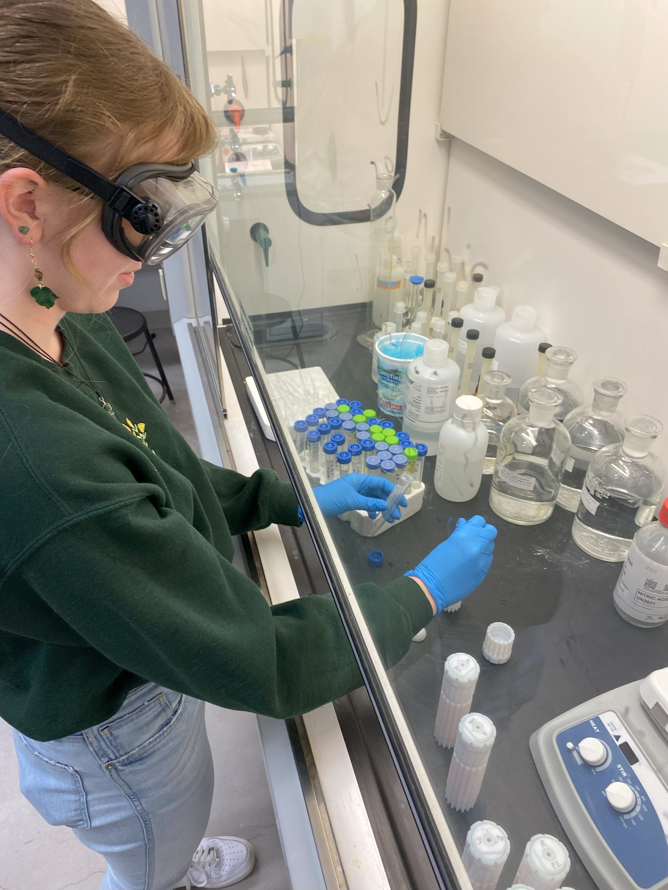
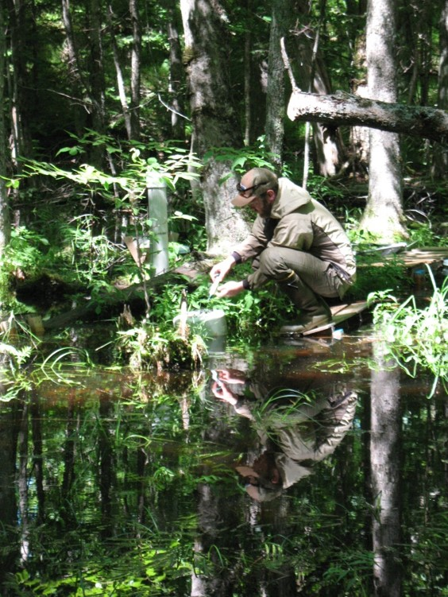
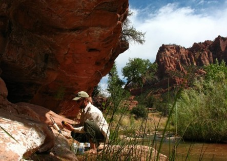
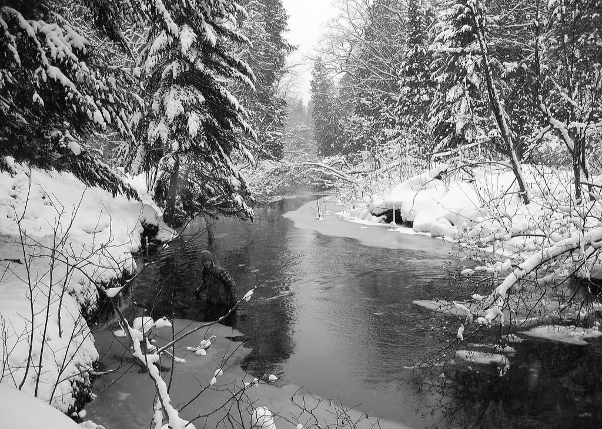

## Applied Agronomy

{style="float:right; margin-left: 5%; fig-align:right; width:50%;" fig-alt="\"Photo taken of two NMU-ABL student research technicians collecting greenhouse gas emission measurements in an experimental cover crop termination study plot at MSU-UPREC."}

We are collaborating with Michigan State University Upper Peninsula Research & Extension Center ([MSU-UPREC](https://www.canr.msu.edu/uprc/)) and [Full Plate Farm](https://www.fullplatefarmmi.com/) to examine implications of soil conservation and cover crop management practices on soil health, greenhouse gas emissions (GHG), soil temperature & moisture, weed occurrence and organic vegetable crop production.

* NMU-ABL undergraduate research assistants recently presented their research at the 2024 Marbleseed Organic Farming Conference (La Crosse, WI), where NMU-ABL members also contributed toward the Organic University Sesssion “Climate Adaptation for Midwest Organic Vegetable Growers” facilitated by a team of researchers from UW-Madison.

 

[**Select Publications & Presentations**]{.underline}:

::: {.content-visible when-format="html"}
* Soil Health: Reduced Tillage Strategies for Organic Farmers. DeDecker et al. 2026. MSU Extension Transition to Organic Partnership Program Seminar. [Click to see](files/DeDecker_MSU TOPP_2026.pdf)
:::

::: {.content-visible when-format="html"}
* Comparing Soil Health and Fertility Outcomes Among Reduced Tillage Practices in Organic Vegetable Crop Production. Van Grinsven et al. 2025. CANVAS Conference. [Click to see](files/Van Grinsven_CANVAS_2025.pdf)
:::

::: {.content-visible when-format="html"}
* Evaluating Soil Temperature, Moisture and Greenhouse Gas Fluxes Among Reduced Tillage Practices for Organic Vegetable Crop Production. Hulstrom et al. 2025. CANVAS Conference. [Click to see](files/Hulstrom_CANVAS_2025.pdf)
:::

::: {.content-visible when-format="html"}
* Comparing Organic Vegetable Production and Weed Management Outcomes Among Reduced Tillage Practices in the Midwest U.S. Lemerand et al. 2025. CANVAS Conference. [Click to see](files/Lemerand_CANVAS_2025.pdf)
:::

 
 
 

## Heavy Metal Testing

{style="float:left; margin-right: 5%; fig-align:left; width:30%;" fig-alt="\"Photo taken of NMU-ABL student research technician digesting food produce samples in trace metal grade nitric acid under a fume hood to prepare samples for heavy metal analysis using ICP-MS."}

We are collaborating with [Dr. Philip Yanguoru](https://nmu.edu/chemistry/dr-philip-yangyuoru) (NMU-Chemistry) to evaluate heavy metal concentrations among conventional, organic and not-certified organic fruit and vegetable production methods to examine the consumer health implications.  This pilot-study is intended to directly inform future research activities where we plan to use inductively coupled plasma mass spectrometery (ICP-MS) methods to examine linkages between heavy metal concentrations in produce with soil, water and crop production management methods.

* NMU-ABL undergraduate research assistants recently presented their research at the 2023 American Chemical Society Regional Chapter Meeting (Marquette, MI), and we are currently also examining heavy metal concentrations among beer styles, container types and production scales.

[**Select Publications & Presentations**]{.underline}:

::: {.content-visible when-format="html"}
* Pick your poison - A comparative study on trace heavy metal concentrations in beverages. Wager et al. 2025. National Honers Society Conference 2025. [Click to see](files/Wager_NHS_2025.pdf)
:::

::: {.content-visible when-format="html"}
* Trace Heavy Metals Analysis in Locally Bought Marquette, Michigan Produce. Wager et al. 2023. American Chemical Society Regional Chapter Meeting. [Click to see](files/Wager_ACS_2023.pdf)
:::

 
 
 

## Mitigation Wetlands

{style="float:right; margin-left: 5%; fig-align:right; width:35%;" fig-alt="\"Photo taken of two NMU-ABL student research technicians using a fence post driver to install a sand-point groundwater monitoring well into a City of Marquette mitigation wetland."}

NMU-ABL has been collaborating with the Marquette County Conservation District and the City of Marquette to monitor hydrological and vegetation conditions within five mitigation wetlands.  A variety of measurement and monitoring methods, including implementing groundwater & meteorological data loggers, collecting herbaceous and woody vegetation surveys, and using UAV for LiDAR mapping have been performed since 2017 to contribute to ongoing assessment activities. 

* Several NMU-ABL researchers have presented their research at conferences such as the Society of Wetland Scientists and American Association of Geographers meetings where past topics included integrating aerial survey & hydrological monitoring data, evaluating the growth and survival of planted tree species, assessing vegetation composition and interannual trends, and examining hydrological connectivity between the mitigation wetlands with surrounding groundwater, Lake Superior and the atmosphere.

[**Select Publications & Presentations**]{.underline}:

::: {.content-visible when-format="html"}
* Use of Aerial LiDAR Survey to Support Restoration and Management Objectives for Mitigation Wetlands in Marquette, MI, USA. Kelly et al. 2023. American Association of Geographers West Lakes Meeting (*1st place - Student Paper Award*). [Click to see](files/Kelly_AAG_2023.pdf)

* Vegetation Composition Assessment and Trend Analysis of Forested Mitigation Wetlands in Marquette, MI. Waatti et al. 2022. Society of Wetland Scientists Annual Meeting. [Click to see](files/Waatti_SWS_2022.pdf)

* Investigating the Hydrological Connectivity of Forested Mitigation Wetlands Between 2019 -2021 in Marquette Michigan, USA. O'Loughlin et al. 2022. Society of Wetland Scientists Annual Meeting. [Click to see](files/O'Loughlin_SWS_2022.pdf)

* Evaluation of Planted Seedling Survival and Growth in Forested Mitigation Wetlands in Marquette Michigan, USA. Van Grinsven et al. 2021. Society of Wetland Scientists Annual Meeting; *ePresentation*. [Click to see](files/Van Grinsven_SWS_2021.pdf)
:::

 
 
 

## Black Ash Wetlands & Forest Resources

{style="float:left; margin-right: 5%; fig-align:left; width:35%;" fig-alt="\"Photo taken of NMU-ABL director collecting gas headspace samples from a static chamber in a black ash wetland."}

As a part of an interdisciplinary team of scientists and resource managers, NMU-ABL personnel have contributed toward a long-term black ash forest resource management investigation in collaboration with the U.S. Forest Service and Michigan Technological University.  Major outcomes of this research have provided critical guidance and recommendations to forest resource managers throughout the Great Lakes region to help mitigate emerald ash borer (EAB) related disturbances.

Applied research activities included evaluating the growth and survival of alternative planted tree seedlings, predicting future black ash ecosystem conditions to examine species tolerances and produce climate adapted species recommendations, evaluating responses of nitrogen cycling, greenhouse gas emissions and wetland water levels to simulated EAB disturbances to provide forest resource management guidance. 

[**Select Publications & Presentations**]{.underline}:

::: {.content-visible when-format="html"}
* Joint Impacts of Future Climate Conditions and Invasive Species on Black Ash Forested Wetlands. Frontiers in Forests and Global Change. 5: 957526. ([Shannon et al 2022](https://doi.org/10.3389/ffgc.2022.957526)).

* Integrating the Effects of Climate Change and Invasive
Species on Wetland Ecohydrology to Evaluate Management Options. Shannon et al. 2020. American Geophysical Union Annual Meeting. [Click to see](files/Shannon_AGU_2020.pdf)

* Nitrogen cycling responses to simulated emerald ash borer infestation in Fraxinus nigra-dominated wetlands. Biogeochemistry, 145(3). ([Davis et al. 2019](https://doi.org/10.1007/s10533-019-00604-2)). 

* Response of Black Ash Wetland Gaseous Soil Carbon Fluxes to a Simulated Emerald Ash Borer Disturbance. Forests 9(6). ([Van Grinsven et al. 2018](https://doi.org/10.3390/f9060324)). 

* Source water contributions and hydrologic responses to simulated emerald ash borer infestations in depressional black ash wetlands. Ecohydrology 10(7). ([Van Grinsven et al. 2017](https://doi.org/10.1002/eco.1862)). 
:::

 
 
 

## Water Resources & Aquatic Ecoystems

::: {layout-ncol=2}
{width=100%}

{width=100%}

:::
NMU ABL has worked with a variety of government agencies and and non-governmental organizations including the National Park Service Northern Colorado Plateau Inventory & Monitoring Network and the Huron Mountain Wildlife Foundation to conduct aquatic resource investigations.  Outcomes of this research have provided guidance and recommendations to watershed managers throughout the Colorado Plateau and Great Lakes regions of the U.S. to support aquatic life, water quality and human health related resource management projects.

Applied research activities included collecting and reporting the condition of surface water bodies in all national park units in the Northern Colorado Plateau Network, and installing and maintaining stream and riparian groundwater monitoring equipment in Utah and in Michigan to support aquatic habitat assessment research projects. 

[**Select Publications & Presentations**]{.underline}:

::: {.content-visible when-format="html"}
* Riparian Monitoring of Wadeable Streams Protocol for Park Units in the Northern Colorado Plateau Network. Weissinger et al. 2018. NPS Natural Resource Report (1636). [Click to see](files/Weissinger_NRR_2018.pdf)

* Estimation of Streambed Groundwater Fluxes Associated with Coaster Brook Trout Spawning Habitat. Groundwater 50(3). ([Van Grinsven et al. 2012](https://doi.org/10.1111/j.1745-6584.2011.00856.x). 

* Water Quality in the Northern Colorado PlateauNetwork, 2006–2009. Van Grinsven et al. 2010. NPS Natural Resource Technical Report (358). [Click to see](files/Van Grinsven_NRR_2010.pdf)

:::

 
 
 
 

This site is hosted by Dr. Matthew J. Van Grinsven  
Northern Michigan University Earth Environmental & Geographical Sciences Dept. (NMU-EEGS) 

For more information: <https://nmu.edu/eegs/matthew-van-grinsven>.